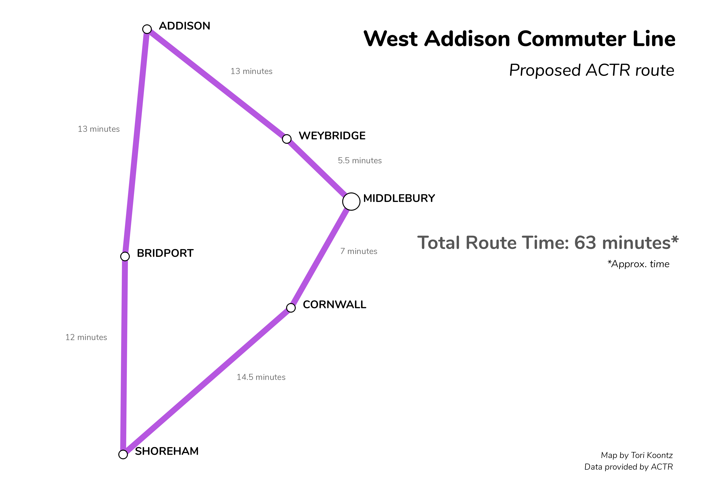
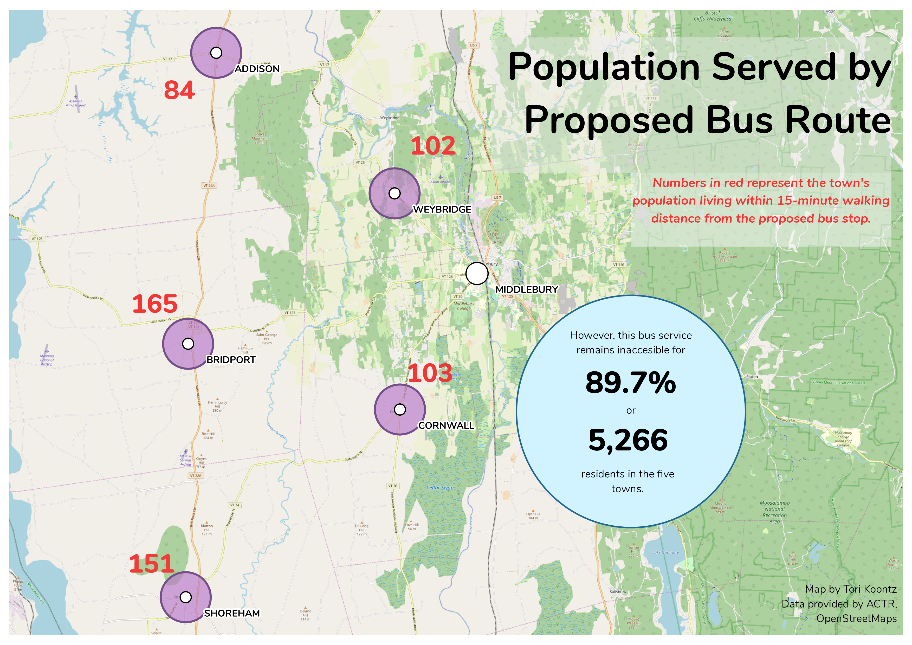

## Developing new Bus Routes for Underserved Populations in Western Vermont

For an independent problem in Human GIS, students had to develop a new public transit route to connect rural communities in Western Vermont with the bus station in Middlebury, which served as a hub for other transportation services. Additionally, access to Middlebury is important for marginalized farm workers because it has the nearest hospital and related health services. Students had to consider how to make their route the most efficient in order to serve the most people possible. 

### Data 

All data for this lab was provided by the professor in the following [file](ip2.gpkg).

It includes relevant data such as "roads", "ACTR_Stops", "blocks" (Census block groups), and "e911", which shows all residential properties in Addison County.

Roads are provided by ESRI

ACTR Stops are provided by [ACTR](https://actr-vt.org/)

e911 locations are provided by the Vermont Open Geodata Portal

Census block groups and towns are provided by the 2010 U.S. Census

### Methods 

1. Using Route Analysis tools in QGIS, I calculated which roads offer the most efficient link from Middlebury to Weybridge, Addison, Bridport, Shoreham, and Cornwall (in that order). 

2. Next, I joined information from "e911" to "blocks" to determine where residencies are located, and then used QGIS's Buffer and Iso-Area tools to demonstrate the homes within a 15-minute walk to the proposed bus stop.

3. After the buffer area was created, I used population information to calculate the percentage of people in the communities who had easy access to the bus route. 

### Discussion 

Addison County Transit Resources, or ACTR, is the only public transport option for Addison County, VT. Much of the county is rural, and the main services shuttle people to and from Middlebury and Burlington, principally. However, this leaves numerous towns underserved by public transport options, especially lower-income laborers who do not own personal vehicles. The most glaring missing route to ACTR’s current services would be in the western portion of the county. This map illustrates a proposed route, which would connect five towns in the region with the bigger ACTR hub in Middlebury, VT. Times between stops are listed, as well as the total route time. 

Using GIS technology, I calculated the percentage of the five towns’ populations that fell within a 15-minute walking distance of the proposed bus stops, represented in the next map by the purple circles. And while each surrounding zone seems to offer a sizeable population for potential riders, certain equity issues arise when looking at the bigger picture. When considering the total combined population of the towns compared to those in the areas of easy-access, it is less than ideal; 89.7% of the population is unable to easily access the bus stop. This number is troubling when considering the lack of mobility for those without personal vehicles, such as low-income agricultural workers. 

Crucial services such as healthcare are very much unevenly distributed within physical and political landscapes, creating issues of equity and accessibility (Meade, Emch 2010). Larger cities with higher populations, or areas with more high-income populations are the most likely to have the best access to high quality health services, while rural, poorer localities such as those in Western Addison County are far removed from these services. The final map shows the location of farms in the region, along with the only nearby hospital in Middlebury. While some farms are relatively close to the bus stops and could potentially use public transport to access the hospital, the majority of farms fall outside of the vicinity of the stops. 
	One potential solution to this problem could be a “quick stop” policy for farms along the route, as many are located on the roads used by the buses, though this would come at the cost of making the route longer and less efficient. 

While a new bus route will help provide public transport to an area greatly underserved in transportation options, not many live close enough to the stops and therefore are able to easily use the service. While these numbers only represent populations within a walking distance, and it is possible for more people to access the bus route by first driving closer to the stop, the greatest concern comes from those who have no form of personal transportation, such as a car. This is the case for the many agricultural workers who are economically and geographically limited. 

Tori Koontz 2019 

Back to [home](index.md)
