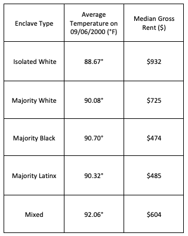

## Mapping Segregation in Houston through Temperature

For our first independent exam in GEOG120, we used GIS to map segregation in Houston, looking at factors such as race, rent prices, and surface temperatures in order to map problems of equity in the city. 

### Maps and Discussion 

Houston, Texas is one of the most ethnically-diverse and welcoming cities in America, and this diversity has been the driving force behind its status as a cosmopolitan center (Roberto, Korver-Glenn; 2018). Despite this high level of diversity, the city remains highly segregated. As the following maps show, the distribution of the white and Latinx population in Houston are spread over many different census blocks and in varying quantities. It becomes clear, however, when comparing these maps that segregation is still highly prevalent in Houston, just in larger, sparser blocks with areas of overlap as well. Another pattern visible in this map is Hoyt’s concentric zones, which states that more economically-privileged populations (principally white) have the resources to live farther away from the CBD, while ethnic minorities without means have to stay closer in the urban center (Knox, Marston; 2013). 

Out of the three populations analyzed in our data, the Latinx population in Houston is by far the most geographically dispersed, with greatest densities close to the central business district and expanding outward. The southwest region of the city is important to note, as it is a more expensive (as determined by the next map of rent prices) and metropolitan area shared by all three groups in the data; despite a high level of mixing, there still exist regions of segregation on the smaller scale, especially when comparing the white distribution to the other two. Another important detail of Houston’s urban structure reflected in these segregation maps is the influence on physical barriers, such as streets and highways, on separation of ethnic groups into small enclaves. Block groups act as segregated clusters determined by road placement and have historically been intentionally placed to encourage or maintain segregated neighborhoods (Roberto, Korver-Glen; 2018).

A close-up of the southwest region: 

Another factor to consider when looking at urban segregation is the housing market. Due to factors of redlining and other exclusionary policies, many marginalized urban dwellers have little (if any) mobility and are often unable to move to another area of the city, due to a lack of resources or loans (class lecture). This concept is represented in this map, with areas farther from the central business district having higher property values; these areas also overlap with the heavy distributions of the white population of Houston. One area of exception is the Southwest region close to the CBD with both higher rent prices and a high level of ethnic mixing, which is most likely occurring due to a revitalization of downtown Houston. However, the pattern does not apply to the other areas where minority enclaves are present, as the rent prices tend to be much lower in those regions. 

Next steps: Analyzing Surface Temperatures in Connection to Segregation

These maps take a more in-depth look at the southwest region of the city, where one of the cooler temperature zones are located among other extremely hot areas. From comparing these two, we see that the green, lower temperature zone is also more forested and less developed, leading to a cooler canopy which protects from the sun and heat. The region directly below, however, is heavily developed and also experienced much higher surface temperatures on Sept. 6th. As Heynen et. al. explain, natural resources like trees in urban settings are disproportionately distributed to favor white, upper-class citizens, to the detriment of minority urban populations (2006).

By comparing both the temperature and median rent by each enclave grouping, we can get a better understanding if the heat exposure in Houston is worsened by segregation. The following table makes a strong case for the presence of segregation in Houston through the rent prices (the price of rent for the Isolated White group is almost twice as much as that of the Majority Black group), but the evidence for disproportionate ecological harms such as heat waves is less convincing, with most only varying slightly. However, we do see quite a large difference between the Isolated White and Mixed groups, which could hint at a slightly uneven distribution of environmental harms in Houston due to segregation.

### Data and Sources

•	Rent and population data is from the U.S. Census Bureau 
•	Polygon layers and GeoPackage file were provided by NHGIS
•	Base maps were downloaded from Open Street Maps 
•	Satellite imagery and heat map data was provided by NASA/USGS

•	Heynen, Nik; Perkins, Harold; Roy, Parama. 2006. The Political Ecology of Uneven Urban 
Green Space. Urban Affairs Review 42 (1):3–25.

•	Knox, P., and S. Marston. 2013. City spaces: Urban structure. In Human geography: 
places and regions in global context, 384–413. Boston, MA: Pearson.

•	Roberto, Elizabeth; Korver-Glenn, Elizabeth. 2018. The Spatial Structure and Local 
Experience of Segregation in Houston, TX. University of New Mexico. 

Tori Koontz 2019 

Back to [home](index.md)
