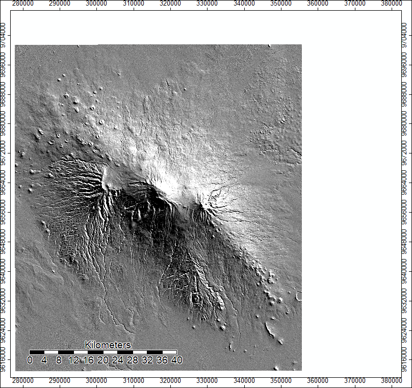
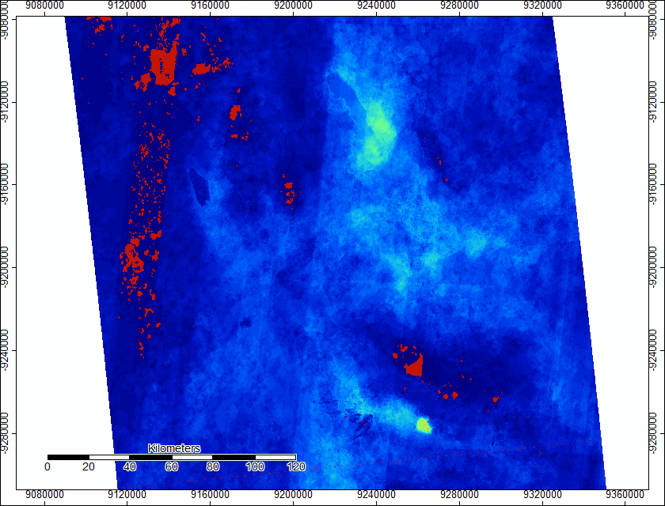

## Lab 3: Global Digital Elevation Models 

This week in lab, we used digital elevation model data to analyze various terrain outputs, such as a map of the hydrology network on Mt. Kilimanjaro, using SAGA.

As a first step, we access either ASTER or SRTM data from www.earthdata.nasa.gov . I decided to use SRTM data and selected data from the two tiles containg Mt. Kilimanjaro, identified by lower left coordinates S03E037 and s04E037. I downloaded the two files and opened them using SAGA. 

Once in SAGA, I ran the Mosaicking tool in order to create one, smooth image combining the two data files. 
 

Next, we changed the projection to the correct UTM zone so as to be able to perform linear calculations accurately. After, we utilized the "Analytical Hillshading" tool in SAGA to better see the terrain and where light would hit it at different angles/different times of day. 

Mt. Kilimanjaro's terrain at noon...

And again at sunrise:

The next tool we ran was called "Sink Drainage Route Detection", which identifies which direction water flows when it encounters sinks. It is helpful to identify where these areas are, as they can impact a map of the hydrology network if not removed.

After we identified the sinks, we used a preprocessing tool called "Sink Removal" to create a map of our mosaic without those tricky sink areas, which will help us better map hydrology. 

Now that we had a mosaic layer without sinks, we could run Hydrology analysis tools, like "Flow Accumulation". This tool allows us to see where water is gathering from the top of the mountain as it flows down. Darker lines represent higher values, meaning that as the stream trickles down, it has more and more water sources feeding into it. The more sources feeding in at any one grid cell means a higher numerical value. 

Now we can run a tool called "Channel Network", which maps out the hydrology network of the area. This is the result I got: 

## Lab 4: DEM Analysis using Batch Script Processing 

In our next lab, we focused on completing the same set of tools and analyses (Mosaic, Sink Detection, sink fill, flow accumulation, channel network), only this time we wrote a batch script in order to run the tool. You can access the script [here](batch_asterelevation_analysis.bat). 

As a note, this tool took quite a long time to run; multiple hours for the last tool alone. The channel network that was created was incredibly detailed, perhaps too much so, which is my guess as to why the tool crawled at a grueling pace. In the future, I would only use this tool on a smaller, more specified area, and would consider increasing the threshold for which streams to classify. 

One additional resource we used were the .num files for both ASTER and SRTM data. These .num files show error, which is important to consider when running analysis. 

This image shows the regions of error or uncertainty within the SRTM's data of Mt. Kilimanjaro. Regions in blue show where the file pulled from ASTER data to fill in gaps. Other areas of uncertainty are shown in blues and reds. This region is on the mountain and a bit south. 
.png)

This next image is the .num file for ASTER data of Mt. Kili. There was quite a bit of error in the north. 

Next, we used SAGA's Grid Difference tool to show regions of diversion within the ASTER and SRTM outputs, shown here: 
  -I haven't created this yet-
  
After that, we pulled the two data outputs into QGIS to more closely examine potential causes of error. 

-some more stuff here I haven't finsished-

Data sources: 
www.earthdata.nasa.gov
SAGA 6.2

Back to [home](index.md)
