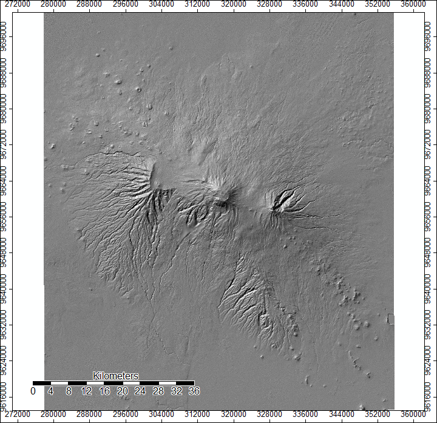
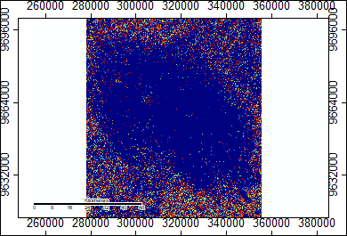
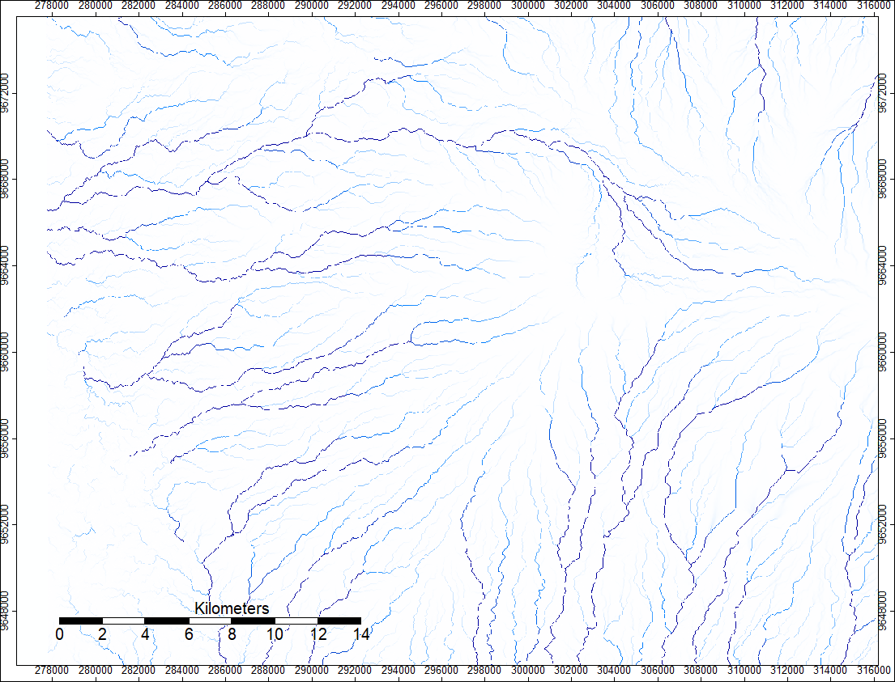
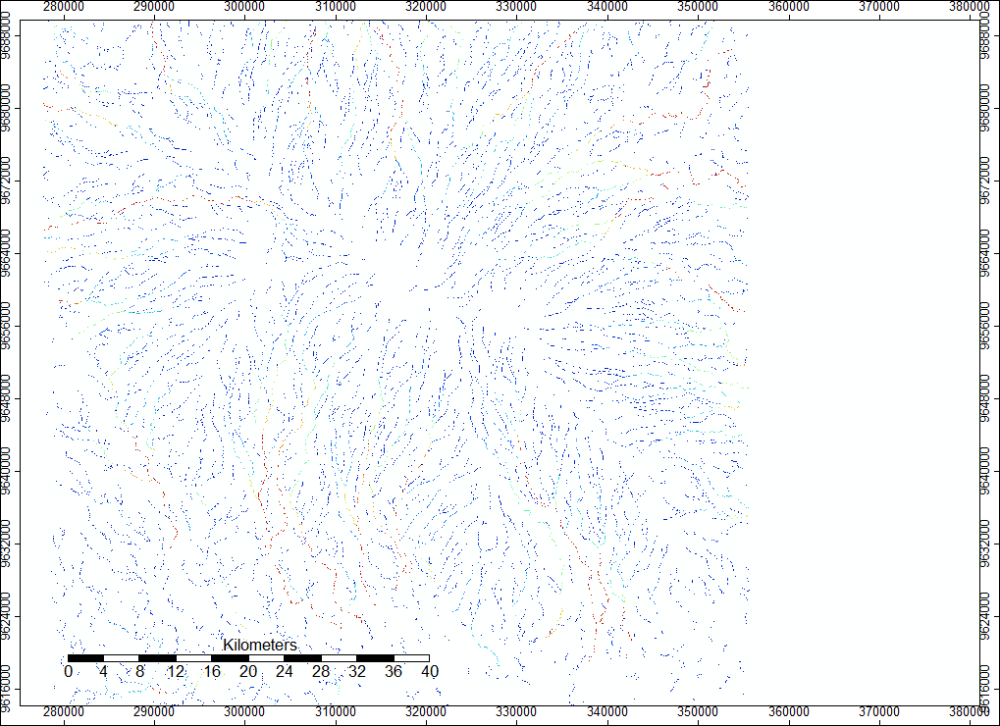

## Lab 3: Global Digital Elevation Models 

This week in lab, we used digital elevation model data to analyze various terrain outputs, such as a map of the hydrology network on Mt. Kilimanjaro, using SAGA.

As a first step, we access either ASTER or SRTM data from www.earthdata.nasa.gov . I decided to use SRTM data and selected data from the two tiles containg Mt. Kilimanjaro, identified by lower left coordinates S03E037 and s04E037. I downloaded the two files and opened them using SAGA. 

Once in SAGA, I ran the Mosaicking tool in order to create4 one, smooth image combining the two data files. 
 

Next, we changed the projection to the correct UTM zone so as to be able to perform linear calculations accurately. After, we utilized the "Analytical Hillshading" tool in SAGA to better see the terrain and where light would hit it at different angles/different times of day. 

Mt. Kilimanjaro's terrain at noon...

And again at sunrise:

The next tool we ran was called "Sink Drainage Route Detection", which identifies which direction water flows when it encounters sinks. It is helpful to identify where these areas are, as they can impact a map of the hydrology network if not removed.

After we identified the sinks, we used a preprocessing tool called "Sink Removal" to create a map of our mosaic without those tricky sink areas, which will help us better map hydrology. 

Now that we had a mosaic layer without sinks, we could run Hydrology analysis tools, like "Flow Accumulation". This tool allows us to see where water is gathering from the top of the mountain as it flows down. Darker lines represent higher values, meaning that as the stream trickles down, it has more and more water sources feeding into it. The more sources feeding in at any one grid cell means a higher numerical value. 

Now we can run a tool called "Channel Network", which maps out the hydrology network of the area. This is the result I got: 

Back to [home](index.md)
