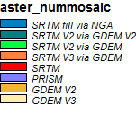
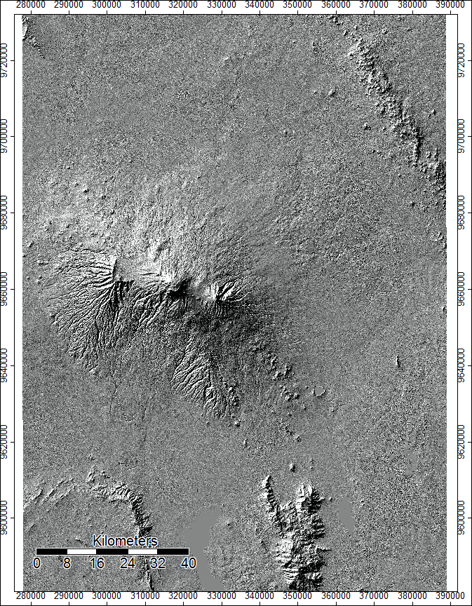
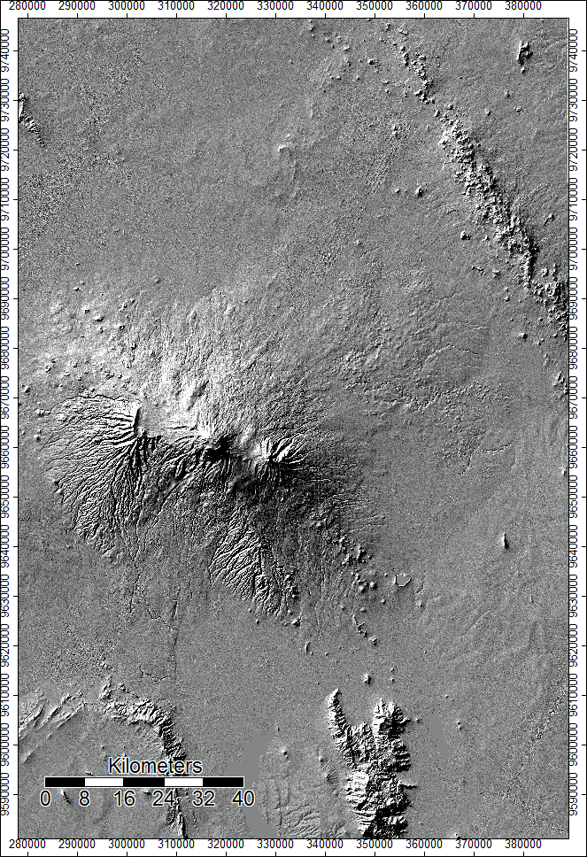
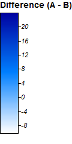
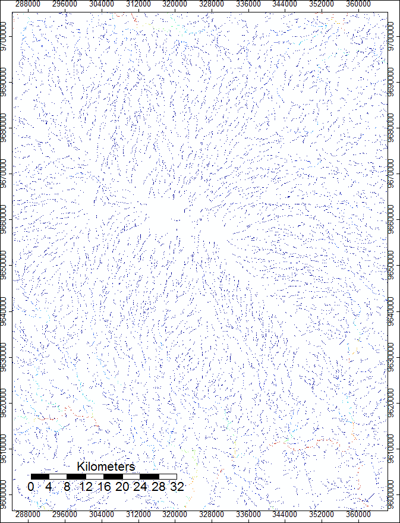
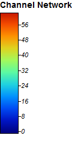
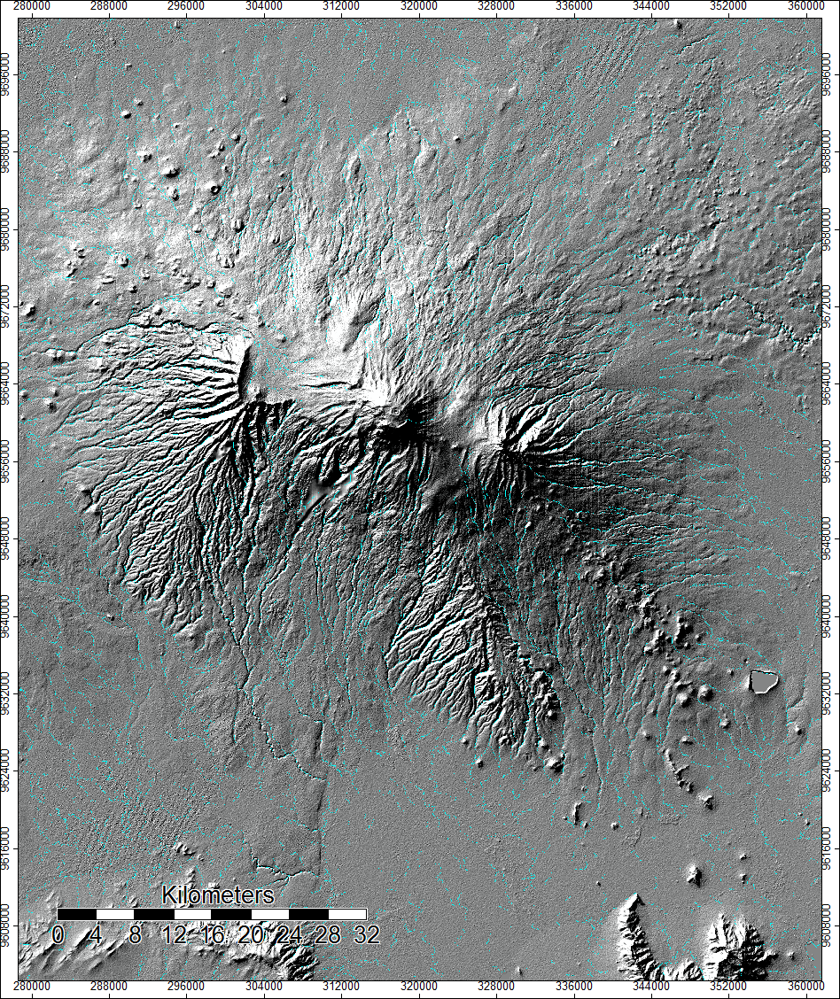
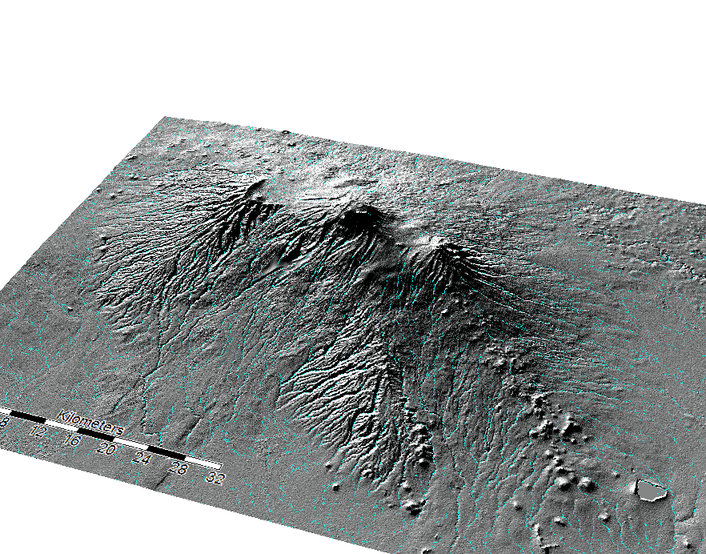

## Lab 4: DEM Analysis using Batch Script Processing 

In our next lab, we focused on completing the same set of tools and analyses (Mosaic, Sink Detection, sink fill, flow accumulation, channel network), only this time we wrote a batch script in order to run the tool. You can access the script [here](batch_asterelevation.bat). 

As a note, this tool took quite a long time to run, as creating a channel network of the flow accumulation takes a great deal of computing. In the future, I would only use this tool on a smaller, more specified area, and would consider increasing the threshold for which streams to classify. 

One additional resource we used were the .num files for both ASTER and SRTM data. These .num files show error, which is important to consider when running analysis. 

This image shows the regions of error or uncertainty within the SRTM's data of Mt. Kilimanjaro. Everything in beige represents SRTM data, while other colored areas represent uncertainty; the legend shows which data sorce was used to pull in data to account for that. Of most importance are the areas in red, where this SRTM file used ASTER data to account for error. 

 

This next image is the .num file for ASTER data of Mt. Kili. There was quite a bit of error in the south, and SRTM data was pulled in for that area. However, this file seems to show less error overall. 

 

SAGA has a tool called Analytical Hillshade, which is really helpful for vizualizing terrain. Looking at the following ASTER and SRTM hillshade files, respectively, we can see that there doesn't seem to be any areas that look drastically different. However, it does show some textural differences in that the SRTM hillshade is smoother, which could explain the trend of ASTER data, rather than SRTM data, reporting higher elevations which we see with the Grid Difference tool.

Next, we used SAGA's Grid Difference tool to show regions of diversion within the ASTER and SRTM outputs. This next image shows the difference of starting elevation models. Areas in darker blue represent areas in which ASTER data reported higher elevations, while whiter regions show where SRTM reported higher numbers. This helps us contextualize the regions of error we see in the .num files and the hillshading.

 

This lab was focusing on recreating the outputs and analyses of the previous lab, which can be accessed under my "lab 3" page, and the following are some of the outputs I got through running batch script. It took awhile to find all the parameters in the code, and my biggest problem in this lab came from misinterpretting the setting options for flow accumulation, in which I had the computer calcultating at a much smaller threshold for creating streams, which increased computing effort tenfold and took hours to run. I eventually figured out the problem and the rest ran smoothly. 

ASTER data Channel Network output:

 

And for SRTM data: 

 

I also put the hillshading onto these channel networks to better help the vizualization. This is the one using ASTER, followed by the one for SRTM. 

SAGA also has a really cool 3D option to create better vizualizations of data. I took the last two hillshades and applied a 3D view to them and received the following images: 

For ASTER

And SRTM 

 

Data sources: 
www.earthdata.nasa.gov
SAGA 6.2
QGIS 3.8.1
